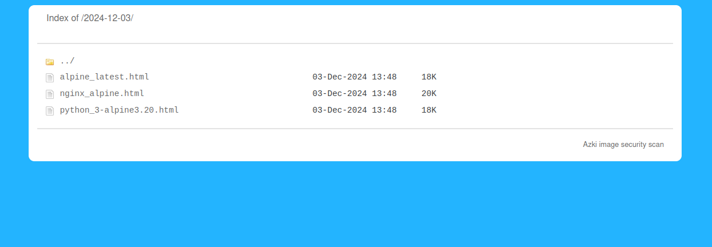
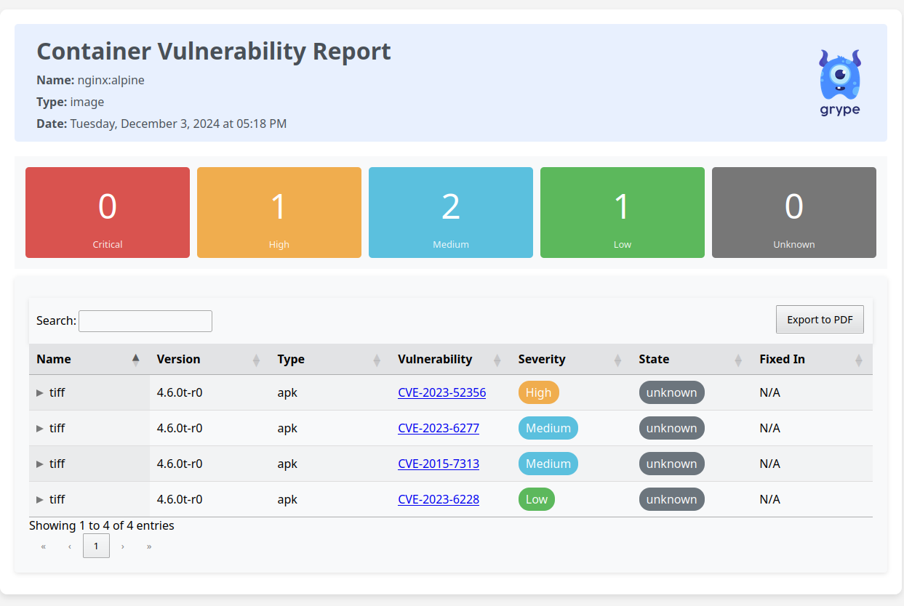

# Image Security Scan

Image Security Scan is an open-source tool designed to analyze docker images using [grype](https://github.com/anchore/grype) tool for potential security vulnerabilities. It helps organizations ensure that their applications doesn't inadvertently introduce security risks.

## How to run

To install Image Security Scan, follow these steps:

1. Clone the repository:

    `git clone https://github.com/erfantkerfan/image-sec-scan.git`

2. Navigate to the project directory:

    `cd image-sec-scan`

3. Setup proper settings:

    1. setup your docker mirror and desired web port in `.env` for building the project if are using an air gapped environment and exposing the webserver.
    
    2. setup the images you want to scan in the `images.txt` file.

4. Run the project:

    1. use `docker compose up -d web` to run the webserver

    2. use `docker compose up --build generator` to run the first adhoc image scan job

    3. create a scheduled scan job based on your needs. crontab for Fridays sample: `0 0 * * FRI root { cd /opt/image-sec-scan && docker compose up --build generator; } > /opt/image-sec-scan/run.log 2>&1`

    4. Visit `http://127.0.0.1:8888` (default port) to explore the generated scan reports.

## ToDo:

- Adding K8S solution (manifests or helm)

## Notes:

- *Open for contribution*

- *The time I spent on this project was sponsored by my employer at the time: [Azki](https://www.azki.com)*
